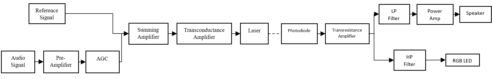
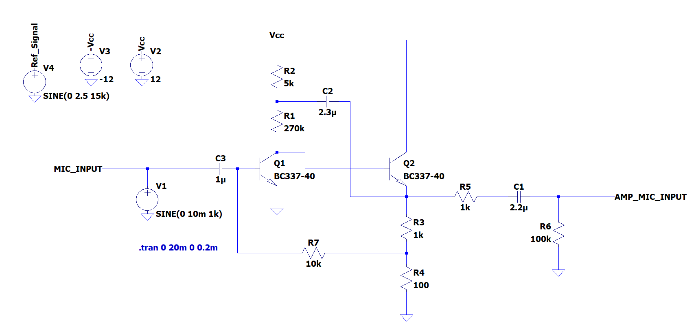
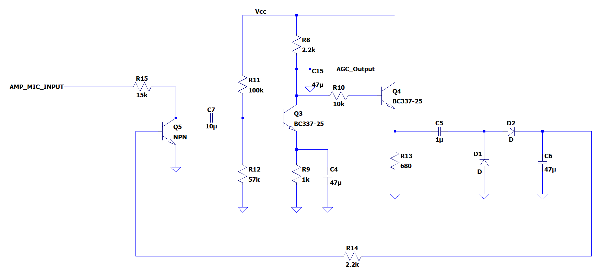
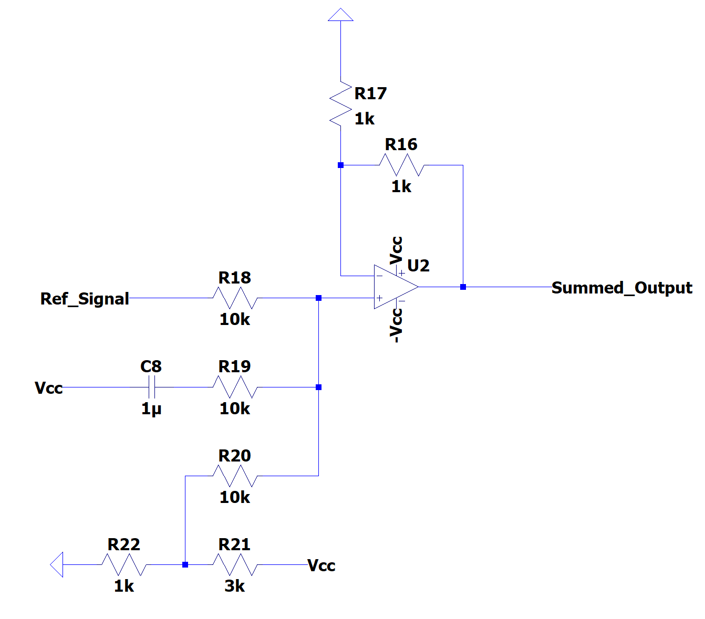
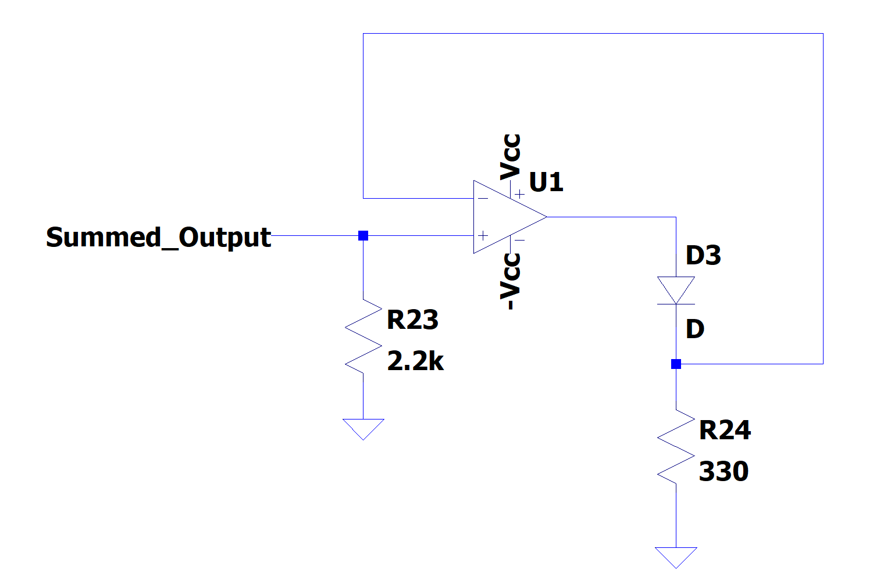
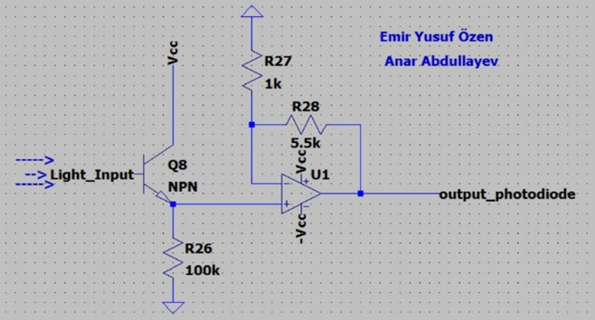
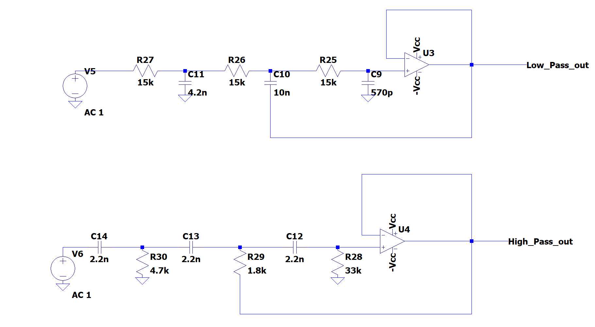
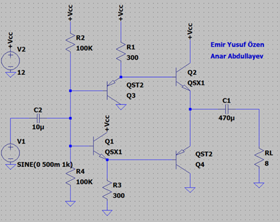
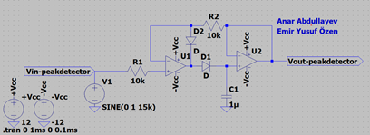
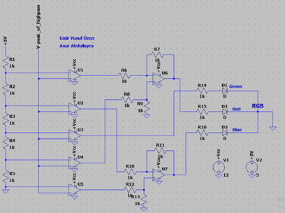

# Optical Wireless Communication System (Photophone)

An analog optical wireless communication system inspired by Alexander Graham Bell’s *Photophone*.  
The system transmits voice signals over modulated visible light and recovers the audio at the receiver while indicating signal strength using an RGB LED.

> EE313 Analog Electronics Laboratory – METU

---

## Overview

This project implements a free-space optical communication system consisting of a transmitter and a receiver.  
A voice signal captured by a microphone is amplified, automatically gain-controlled, multiplexed with a high-frequency reference signal, and transmitted via a laser diode.  

On the receiver side, the optical signal is converted back to an electrical signal, demultiplexed using filters, amplified to drive a speaker, and analyzed to display signal strength.

---

## System Architecture

**Main subsystems:**
- Microphone and Preamplifier  
- Automatic Gain Control (AGC)  
- Signal Multiplexer (Audio + Reference)  
- Laser Driver (Transconductance Amplifier)  
- Free-Space Optical Channel  
- Phototransistor Receiver (Transimpedance Amplifier)  
- Low-Pass and High-Pass Filters  
- Audio Power Amplifier  
- Signal Level Indicator (RGB LED)

---

## Transmitter Design

### Microphone Preamplifier

The microphone signal is amplified using a common-emitter BJT amplifier followed by a buffer stage.  
This stage boosts the low-amplitude microphone output to a usable level for further processing.

---

### Automatic Gain Control (AGC)

An automatic gain control circuit is used to maintain a stable signal amplitude regardless of variations in sound intensity or distance.  
The AGC prevents clipping and ensures reliable transmission.

The design uses a BJT acting as a voltage-controlled resistor to dynamically adjust the gain.

---

### Signal Multiplexing

The amplified audio signal (0–3.4 kHz) is summed with a high-frequency reference signal (15 kHz) using an op-amp summing amplifier.  
A DC bias is added to ensure proper laser diode operation.

---

### Laser Driver

The multiplexed signal drives a laser diode through a transconductance amplifier.  
This converts voltage variations into proportional current changes, enabling linear optical modulation.  
A DC bias ensures operation above the laser threshold current.

---

## Receiver Design

### Optical Receiver

A phototransistor is used to detect the transmitted modulated light.  
The generated current is converted back to voltage using a transimpedance amplifier.

---

### Demultiplexing Filters

The received signal contains both audio and reference components.  
To separate them, third-order Butterworth filters are used.

| Filter | Cutoff Frequency |
|------|------------------|
| Low-Pass Filter | 3.4 kHz |
| High-Pass Filter | 10 kHz |

  

---

### Audio Power Amplifier

The recovered audio signal is amplified using a Class AB power amplifier with a complementary push-pull configuration.  
TIP41-A and TIP42-C power transistors are used to achieve up to 1 W output power with low distortion.  
The design includes impedance matching and volume control.

---

## Signal Level Indicator

The reference signal is processed using a high-pass filter and peak detector, then compared against predefined thresholds using comparator circuits.  
A single RGB LED indicates signal strength with discrete color levels.

| Signal Strength | LED Color |
|----------------|-----------|
| No Signal | Green |
| Weak Signal | Cyan |
| Moderate Signal | White |
| Good Signal | Magenta |
| Excellent Signal | Blue |

  

---

## Results

- Clear voice transmission over free space  
- Stable audio amplitude due to AGC  
- Successful frequency-division multiplexing and demultiplexing  
- Accurate signal strength visualization  
- Strong agreement between simulation and experimental results  

---

## Technologies Used

- Analog electronics  
- BJTs, operational amplifiers, passive components  
- Visible light laser diode (< 5 mW)  
- Phototransistor  
- Signal generators and oscilloscopes  
- Class AB power amplifier  

---

## Challenges and Learnings

- Designing a stable AGC without distortion  
- Preventing clipping across multiple analog stages  
- Achieving sharp frequency separation with real components  
- Laser biasing and optical alignment  
- Power amplifier efficiency and thermal considerations  

---

## Authors

**Anar Abdullayev**  
**Emir Yusuf Özen**  
Middle East Technical University  
